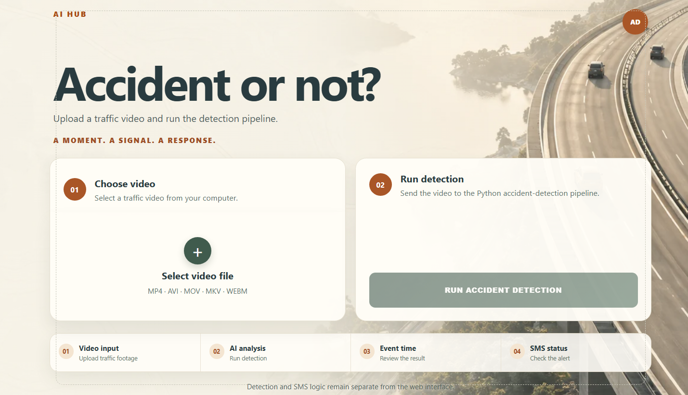

# AI Hub — Accident Detection

A student project for analysing traffic videos and identifying possible vehicle accidents. It connects an animated introduction page and a Flask web interface to the supplied Hybrid detection backend, with TextBee SMS alerts for detected accidents.

## Website preview



*Design preview supplied during development. Small navigation and border details may differ from the final interface.*

## Features

- Upload MP4, AVI, MOV, MKV, or WEBM traffic videos.
- Run the real Hybrid backend and review the first detected event.
- View the event time, confidence, snapshot, and SMS status.
- Print the result or save it as a PDF through the browser.
- Run labelled batch experiments with JSON logs and Excel/CSV reports.

```text
Introduction → Get Started → Upload video → Hybrid analysis → Result
                                                               ↓
                                               SMS attempt if accident
```

The backend combines object detection/tracking, motion features, CLIP scene features, a temporal model, and event-decision rules. Background animations are decorative and do not represent live detection results.

## Requirements

- Windows with Python 3.11 (64-bit) for the commands below.
- Git with Git LFS, and VS Code or another editor.
- Several GB of free disk space for packages and models.
- Internet for installation, the introduction page's external assets, and SMS.
- Your own TextBee account/device configuration if you want SMS alerts.

The supplied configuration uses CPU/OpenVINO. Processing time depends on the computer and video length.

## 1. Download the complete project

In PowerShell, run:

```powershell
git lfs install
git clone -c core.longpaths=true https://github.com/shravani210406/AI-HUB---ACCIDENT-DETECTION.git
Set-Location .\AI-HUB---ACCIDENT-DETECTION
git lfs pull
code .
```

Use a short parent folder if Windows reports a path-length error. Prefer cloning with Git LFS: GitHub ZIP downloads may contain small model pointers instead of the full weights.

## 2. Install dependencies

In VS Code, select **Terminal → New Terminal**. Run these commands from the folder containing `app.py` and `requirements.txt`:

```powershell
py -3.11 -m venv .venv-local
& .\.venv-local\Scripts\python.exe -m pip install -r .\requirements.txt
Copy-Item .\.env.example .\.env
```

If `py` is unavailable and Python 3.11 is installed at the usual Windows location, replace the first command with:

```powershell
& "$env:LOCALAPPDATA\Programs\Python\Python311\python.exe" -m venv .venv-local
```

Wait for installation to finish. Environment activation is unnecessary because every command uses its Python interpreter directly. Copy only the commands, without terminal prompt characters such as `PS>` or `>>`.

## 3. Configure SMS

Edit the local `.env` file:

| Variable | Value to provide |
| --- | --- |
| `FLASK_SECRET_KEY` | A private random string for Flask sessions. |
| `TEXTBEE_API_KEY` | Your TextBee API credential. |
| `TEXTBEE_RECIPIENT` | The alert recipient including country code. |
| `TEXTBEE_DEVICE_ID` | Optional device identifier used by the integration. |

Credentials are intentionally excluded from this public repository. Keep `.env` private. If SMS configuration is missing or delivery fails, the web page reports an SMS error separately from the detection result.

## 4. Run the website

From the project root:

```powershell
& .\.venv-local\Scripts\python.exe .\app.py
```

Open **http://127.0.0.1:5000/static/WEBB%2002.html** and click **Get Started**.

The upload page is also available directly at **http://127.0.0.1:5000/**.

1. Select a traffic video.
2. Click **Run Accident Detection** and wait for processing.
3. Review the classification and any event details.
4. Check the SMS status and optionally print/save the result as a PDF.

Press **Ctrl+C** in the terminal to stop the server. For future sessions, use the same start command; reinstalling is unnecessary.

## Batch automation

Batch mode processes a list of labelled videos independently of the website. It generates evaluation reports and does not send TextBee alerts.

Edit `AI_HUB_STAGE2_HYBRID_MODIFIED/experiment_videos.txt`. Add one real video path and its known label per line, without a header:

```text
C:/Videos/accident_sample.mp4,accident
C:/Videos/normal_sample.mp4,normal
```

Replace those example paths with your files. Valid labels are `accident` and `normal`. The supplied list is empty and the full evaluation dataset is not included.

Then run from the project root:

```powershell
Set-Location .\AI_HUB_STAGE2_HYBRID_MODIFIED
& ..\.venv-local\Scripts\python.exe .\main.py
```

The runner creates numbered experiment directories under `logs/`, `reports/`, and `experiment_configurations/`. Outputs include JSON records, diagnostics, `complete_results.xlsx`, and `video_results.csv`. Old logs and reports are excluded from this repository; new batch runs generate them locally.

`generate_report_only.py` is a legacy utility with a fixed input directory, `logs/v2_100`, and `v2_100_*` report filenames. Those old logs are not included, so this utility requires matching logs to be supplied. It does not automatically select the latest experiment. The main batch runner already generates reports for new runs.

## Folder structure

Model-cache internals and saved experiment configurations are abbreviated. Logs and reports are created when batch processing runs.

```text
AI-HUB---ACCIDENT-DETECTION/
├── README.md
├── .env.example
├── .gitignore
├── .gitattributes
├── app.py
├── detector_adapter.py
├── sms_adapter.py
├── requirements.txt
├── static/
│   ├── WEBB 02.html
│   ├── style.css
│   └── assets/aerial-road.webp
├── templates/
│   ├── index.html
│   └── result.html
├── screenshots/
├── uploads/                         # sample clips and runtime uploads
└── AI_HUB_STAGE2_HYBRID_MODIFIED/
    ├── README.md
    ├── requirements.txt
    ├── main.py
    ├── config.py
    ├── experiment_config.py
    ├── experiment_videos.txt
    ├── normal_experiment_backup.txt.txt
    ├── generate_report_only.py
    ├── configs/default.yaml
    ├── hybrid/
    │   ├── __init__.py
    │   ├── backends.py
    │   ├── config.py
    │   ├── decision.py
    │   ├── motion.py
    │   ├── pipeline.py
    │   ├── semantic.py
    │   ├── temporal.py
    │   └── video.py
    ├── models/
    │   ├── hybrid.pt
    │   ├── temporal.xml / temporal.bin / temporal.metadata.json
    │   ├── clip.xml / clip.bin
    │   ├── clip_cache/
    │   └── yolo11n_openvino_model/
    ├── result_logging/
    │   ├── __init__.py
    │   └── result_logger.py
    ├── postprocessing/
    │   ├── __init__.py
    │   ├── log_reader.py
    │   ├── metrics.py
    │   └── report_generator.py
    ├── logs/                       # generated locally, not tracked
    ├── reports/                    # generated locally, not tracked
    └── experiment_configurations/
```

## File guide

Each entry gives a short explanation of its role. Backend paths below are relative to `AI_HUB_STAGE2_HYBRID_MODIFIED/`.

| Web/project file | What it does |
| --- | --- |
| `app.py` | Defines Flask routes, saves uploads, and displays results. Calls detection and conditionally requests an SMS. |
| `detector_adapter.py` | Connects uploads to the Hybrid pipeline. Converts its output into web results and saves event snapshots. |
| `sms_adapter.py` | Builds and sends TextBee messages. Reads credentials from environment variables. |
| `requirements.txt` | Lists dependencies for the complete project. Install this root file for both web and backend support. |
| `.env.example` | Supplies empty configuration fields. Copy to `.env` and enter private local settings. |
| `.gitignore` / `.gitattributes` | Exclude secrets, environments, and new runtime outputs. Configure Git LFS for large weights. |
| `static/WEBB 02.html` | Implements the animated introduction. Get Started opens the local Flask upload page. |
| `static/style.css` | Styles the web interface and background. Includes responsive, reduced-motion, and print rules. |
| `static/assets/aerial-road.webp` | Bundled road artwork. Used by the light automotive interface. |
| `templates/index.html` | Contains the upload form and selection controls. Includes video-selection/preview behaviour. |
| `templates/result.html` | Shows classification, video, event details, and SMS status. Supports event navigation and printing. |
| `screenshots/` | Contains documentation images. Earlier interface captures are retained alongside the preview. |
| `uploads/` | Contains supplied sample clips and receives runtime uploads. Event images are stored in its `snapshots/` folder. |

| Backend file | What it does |
| --- | --- |
| `README.md` | Original backend documentation. Use the root README for combined-project setup. |
| `requirements.txt` | Original backend dependency list. The root list also includes web dependencies. |
| `main.py` | Runs labelled batch experiments. Writes diagnostics and evaluation reports. |
| `config.py` | Defines project and experiment settings. Includes backend selection and CPU options. |
| `experiment_config.py` | Collects experiment settings and creates run names. Supports saved configuration records. |
| `experiment_videos.txt` | Lists batch video paths and labels. Fill it before starting a batch run. |
| `normal_experiment_backup.txt.txt` | Preserves an older experiment list. It is not the active batch input. |
| `generate_report_only.py` | Generates reports from fixed existing logs. Does not run detection. |
| `configs/default.yaml` | Configures models, sampling, thresholds, and inference options. Loaded by the Hybrid backend. |
| `hybrid/__init__.py` | Marks the Hybrid directory as a Python package. Enables imports from the adapter and runner. |
| `hybrid/backends.py` | Provides model execution wrappers. Loads and invokes supported inference backends. |
| `hybrid/config.py` | Loads and validates settings. Resolves model paths relative to the backend. |
| `hybrid/decision.py` | Converts temporal scores into events. Applies thresholds and confirmation rules. |
| `hybrid/motion.py` | Calculates motion and interaction features. Supplies tracked-object information to the pipeline. |
| `hybrid/pipeline.py` | Coordinates decoding, features, inference, and decisions. Returns predictions, events, and diagnostics. |
| `hybrid/semantic.py` | Extracts CLIP scene features. Adds semantic information to motion features. |
| `hybrid/temporal.py` | Supports temporal model processing. Analyses feature sequences over time. |
| `hybrid/video.py` | Decodes video and samples frames. Preserves timing information for analysis. |
| `models/hybrid.pt` | Bundled trained Hybrid checkpoint. Preserved from the supplied backend. |
| `models/temporal.*` | Temporal network, weights, and metadata. Keep the companion files together. |
| `models/clip.*` / `models/clip_cache/` | CLIP model artifacts and cached weights. The large binaries use Git LFS. |
| `models/yolo11n_openvino_model/` | YOLO11n network, weights, and metadata. Supplies road-object detection. |
| `result_logging/__init__.py` / `postprocessing/__init__.py` | Define Python packages for logging/reporting. Enable imports from the runner. |
| `result_logging/result_logger.py` | Saves per-video result records. These records feed evaluation reports. |
| `postprocessing/log_reader.py` | Reads saved experiment logs. Collects results for reporting. |
| `postprocessing/metrics.py` | Calculates metrics using known labels. Supports batch evaluation. |
| `postprocessing/report_generator.py` | Produces Excel and CSV summaries. Formats results and evaluation metrics. |
| `logs/`, `reports/`, `experiment_configurations/` | Store experiment records, reports, and settings. Old logs/reports are omitted; batch runs generate new local outputs. |

## Troubleshooting

| Issue | Solution |
| --- | --- |
| `app.py` or `requirements.txt` not found | Open the root folder containing both files before running commands. |
| `No module named cv2` | Install root requirements using `.venv-local\Scripts\python.exe`, then start with that same interpreter. |
| Python path not recognised | Use `.\.venv-local\Scripts\python.exe` from the root; do not type `..venv-local` or `>>`. |
| Missing/unreadable model | Run `git lfs pull`. Verify the binaries are full files rather than small text pointers. |
| Empty batch list | Add real `path,label` entries to `experiment_videos.txt`. |
| SMS error | Check `.env`, TextBee configuration, recipient, and connectivity. Detection and SMS have separate statuses. |
| Missing landing-page 3D assets | The introduction loads external resources. Check internet or open the upload page at `/`. |
| Slow first analysis | Models initialise on first use. CPU processing may take time; check the terminal for errors. |

## Project notes

This is a local demonstration and research project. Confidence is a model score, not a guarantee; evaluate performance on your own videos. The Flask entry point enables debug mode, and the introduction links to localhost port 5000. Production deployment needs a separate configuration.

Application code, interface files, and model files are retained from the supplied ZIP. Old logs and reports have been removed, and documentation screenshots have been updated. Publication checks compared original application files and checked Python syntax without starting the application, running inference, or sending SMS. Runtime behaviour has not been re-tested during repository preparation.

## Credits and licence

Created by **Shravani Paramesh, Hansini T G, and Harsha K**.

Built using Flask, OpenCV, PyTorch, Ultralytics, OpenVINO, OpenCLIP, Three.js, and TextBee. Third-party components retain their own licences. No project-wide licence was supplied; public availability alone does not grant unrestricted reuse.
